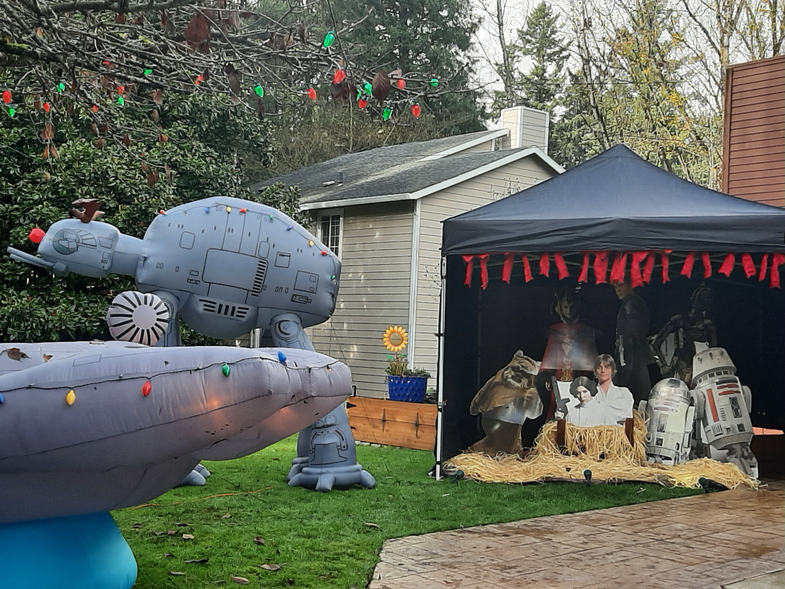

# Welcome

{width=45%; margin=auto}

## Introduction
Hello, My name is Josh Gold, and I'm a security professional based out of Portland, Oregon.   I discuss five of the 2025 Holiday Hack Challenge objectives below.  For each I will include a summary of the challenge, my thought process and a solution overview including screen captures.   

For most of the challenges I went from a starting point of ignorance, progressed to a state of exploration (sometimes guess and check), and sooner or later wound up at an AHA moment.  Often AHA was more later than sooner.  For some of the challenges I found it valuable to call it quits for the day. and return a day later, giving time for thoughts and ideas to evolve.  

I hope you enjoyed the event as much as I did.     
## Answers
!!! success "1. Intro to Nmap - :fontawesome-solid-star::fontawesome-regular-star::fontawesome-regular-star::fontawesome-regular-star::fontawesome-regular-star:"
    [Answer](./objectives/o1.md)

!!! success "2. Going in Reverse - :fontawesome-solid-star::fontawesome-solid-star::fontawesome-regular-star::fontawesome-regular-star::fontawesome-regular-star:"
    [Answer](./objectives/o2.md)

!!! success "3. IDORable Bistro - :fontawesome-solid-star::fontawesome-solid-star::fontawesome-regular-star::fontawesome-regular-star::fontawesome-regular-star:"
    [Answer](./objectives/o3.md) 

!!! success "4. Quantingnome Leap -  :fontawesome-solid-star::fontawesome-solid-star::fontawesome-regular-star::fontawesome-regular-star::fontawesome-regular-star:"
    [Answer](./objectives/o4.md) 

!!! success "5. Rogue Gnome Identity Provider -  :fontawesome-solid-star::fontawesome-solid-star::fontawesome-regular-star::fontawesome-regular-star::fontawesome-regular-star:"
    [Answer](./objectives/o5.md) 

## Conclusion

!!! Abstract "Summary Verse"
	In the SANS Hack Challenge,  
	we test our mettle.  
	Year in and year out,  
	we hope to do better.  
	We often get stuck,  
	take a break and return.  
	With Discord, skill and luck, 
	we unravel cyber riddles and learn.  
	
