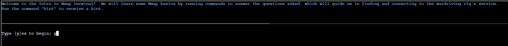
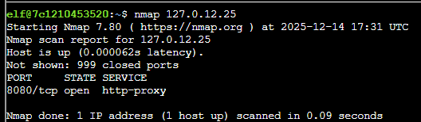
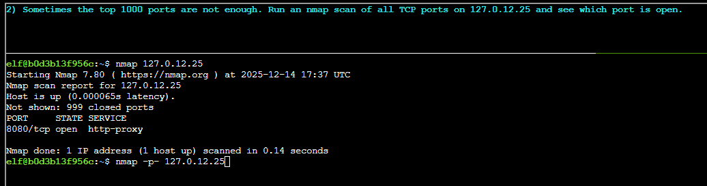

# Intro to Nmap

**Direct link**: [Objective 1 terminal](https://2025.holidayhackchallenge.com/badge?section=objective&id=objNmap)

## Objective

Hey, I'm Eric. I'm an avid motorcyclist, and I love traveling the world with my wife. I enjoy being creative and making things. For example, a cybersecurity tool called [Zero-E](https://github.com/sl3yE/Zero-E) that I'm quite proud of, and the Baldur's Gate 3 mod called [Manaflare](https://www.nexusmods.com/baldursgate3/mods/7755?tab=description). I'm even in the BG3 credits! I also make tools, ranges, and HHC worlds for Counter Hack. Yup, including the one you're in right now. But most of the time, I'm helping organizations in the real world be more secure. I do a bunch of different kinds of pentesting, but speciailize in network and physical. Some advice: stay laser-focused on your goals and don't let the distractions life throws at you lead you astray. That's how I ended up at Counter Hack!

Speaking of tools, let me introduce you to one of the most essential weapons in any pentester's arsenal: Nmap.

It's like having X-ray vision for networks, and I've set up a perfect environment for you to learn the fundamentals.

Help me find and connect to the wardriving rig's service on my motorcycle!

## Solution

Let's run our first nmap scan as follows:

Looks like the results show port 8080 is open so far:

Now we we scan beyond the first 1000 ports and include all the ports using the -p flag:

