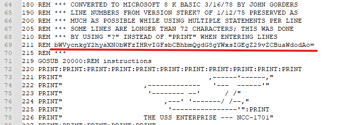
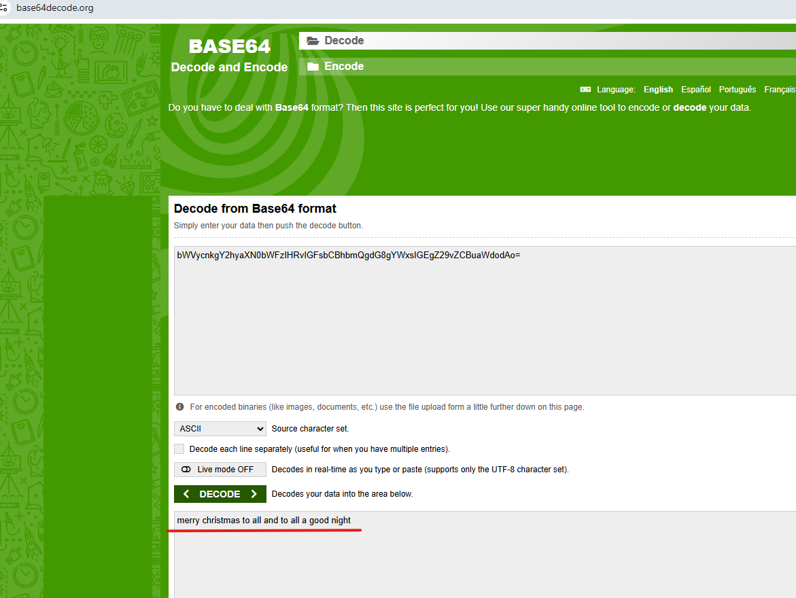

# Going in Reverse

**Direct link**: [Objective 2 terminal](https://2025.holidayhackchallenge.com/badge?section=objective&id=objRetroRecovery) 
**Difficulty**:  

## Objective

Hello, I'm Kevin (though past friends have referred to me as 'Heavy K'). If you ever hear any one say that philosophy is a useless college degree, don't believe them; it's not. I've arrived where I am at because of it. It just made the path more interesting. I have more hobbies than I can keep up with, including Amateur Astronomy, Shortwave Radio, and retro-gaming. Things like backyard observances of distant galaxies, non-internet involved, around the world communications, and those who program for the Atari 2600 still invoke degrees of awe for me. One of the most influential books I've read is "Godel, Escher, and Bach" by Douglas Hofstadter. I'm also a bit of a Tolkien fanatic. My wife and my daughter are everything; without them, I surely would still be kicking rusty tin cans down the lonely highways of my past.

You know, there's something beautifully nostalgic about stumbling across old computing artifacts. Just last week, I was sorting through some boxes in my garage and came across a collection of 5.25" floppies from my college days - mostly containing terrible attempts at programming assignments and a few games I'd copied from friends.

Finding an old Commodore 64 disk with a mysterious BASIC program on it? That's like discovering a digital time capsule. The C64 was an incredible machine for its time - 64KB of RAM seemed like an ocean of possibility back then. I spent countless hours as a kid typing in program listings from Compute! magazine, usually making at least a dozen typos along the way.

The thing about BASIC programs from that era is they were often written by clever programmers who knew how to hide things in plain sight. Sometimes the most interesting discoveries come from reading the code itself rather than watching it execute. It's like being a digital archaeologist - you're not just looking at what the program does, you're understanding how the programmer thought.

Take your time with this one. The beauty of reverse engineering isn't in rushing to the answer, but in appreciating the craft of whoever wrote it. Those old-school programmers had to be creative within such tight constraints.

## Solution

First we download a file that is an image of an old floppy disk.

Likely you could use specialized tools to read the file, but even Notepad++ is helpful here.

You need to do a lot of scrolling!  When you get to readable English text, if you read patiently and carefully, you may see a line that looks out of place.  

It turns out this is a base64 encoded string.  This is recognizable as possibly base64 encoding, because it's all letters and numbers, no symbols here, and ends with an equal sign.  

Let's go to base64decode.org and decode this string, and then we can see the answer!

