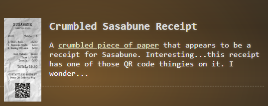
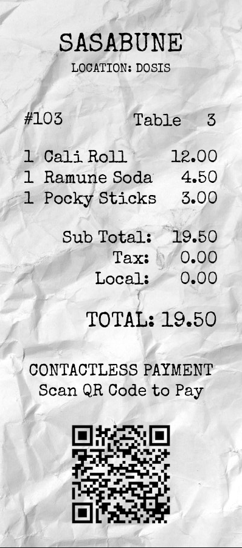
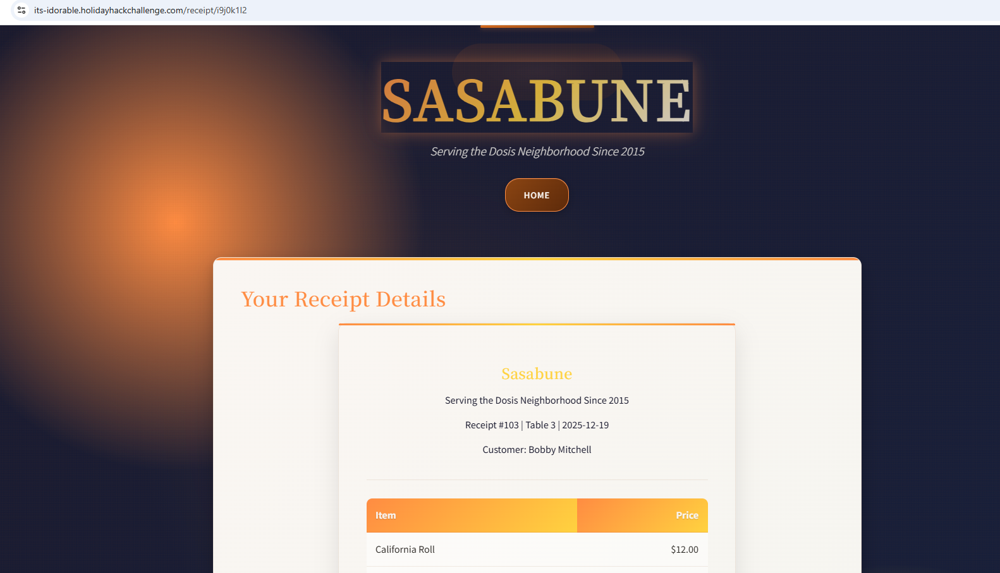
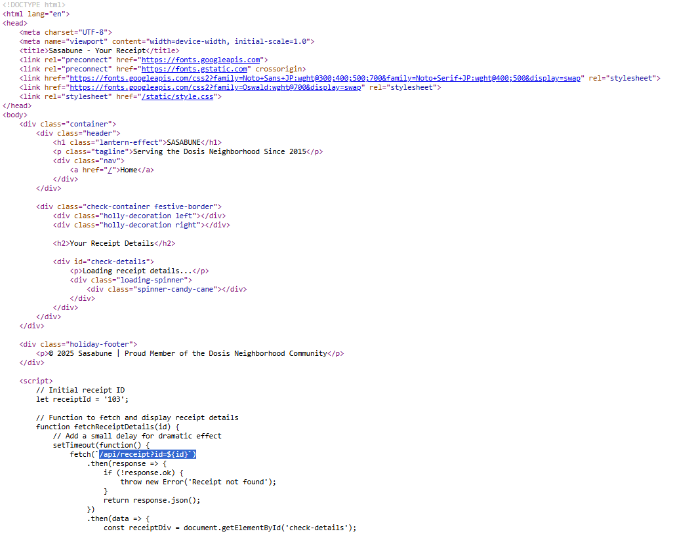
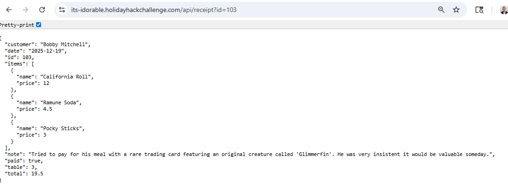
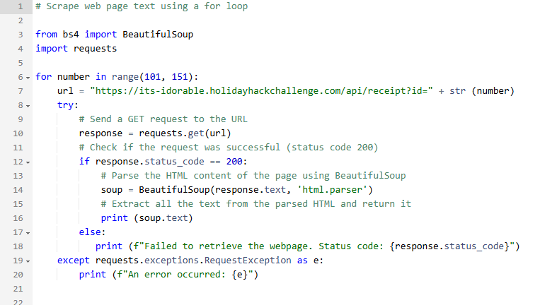
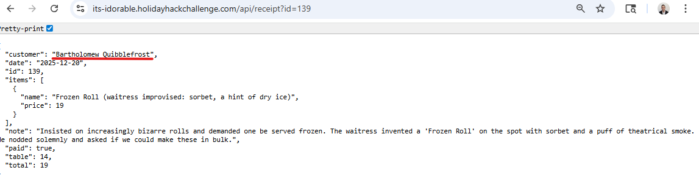

# IDORable Bistro

 
**Direct link**:(https://2025.holidayhackchallenge.com/badge?section=objective&id=objIdor) 
**Difficulty**:  

## Objective
I'm a teetotaling hacker. I sleep about 4 hours a night. Photography is my hobby, but the anachronistic sort: before 1900. Teaching people how to hack and protect systems is my passion.

I need your help with something urgent.

A gnome came through Sasabune today, poorly disguising itself as human - apparently asking for frozen sushi, which is almost as terrible as that fusion disaster I had to endure that one time.

Based on my previous work finding IDOR bugs in restaurant payment systems, I suspect we can exploit a similar vulnerability here.

I was at a talk recently and learned some interesting things about some of these payment systems. Let's use that receipt to dig deeper and unmask this gnome's true identity.

## Hints
QR Codes
From: Santa
Objective: IDORable Bistro
I have been seeing a lot of receipts lying around with some kind of QR code on them. I am pretty sure they are for Duke Dosis's Holiday Bistro. Interesting...see you if you can find one and see what they are all about...

What's For Lunch?
From: Santa
Objective: IDORable Bistro
I had tried to scan one of the QR codes and it took me to somebody's meal receipt! I am afraid somebody could look up anyone's meal if they have the correct ID...in the correct place.

Will the Real ID Please...
From: Santa
Objective: IDORable Bistro
Sometimes...developers put in a lot of effort to anonymyze information by using randomly generated identifiers...but...there are also times where the "real" ID is used in a separate Network request...

## Solution
The first thing is to pick up the receipt that is lying on the ground outside the Sasabune Bistro.  I had trouble finding it because I didn't know yet to change the camera viewing angle to be able to see the sides of the buildings.

Next, note the order #103 at hte top left of the receipt for later, and scan the QR code on the receipt.

The QR Code brings us to the following website: https://its-idorable.holidayhackchallenge.com/receipt/i9j0k1l2

The receipt number is encoded, but we did get a hint that the real receipt ID might be used in a separate network request.

For any website in a hack challenge, it doesn't hurt to look at the page source for comments left behind or other helpful information:

We can see line 50 might be interesting: _fetch(`/api/receipt?id=${id}`)

We might be able to make an API request with the receipt number directly:

https://its-idorable.holidayhackchallenge.com/api/receipt?id=103

We can do a binary search method to test the range of valid receipt numbers below 103.  Or we could assume receipts start at order #100.  Either way we quickly find that the first receipt available is #101.

There's probably not that many receipts in the system at a time most likely, so order numbers probably go up to about 200.  It is pretty quick to determine the highest order number available in the system is 152.

Next let's scrape all the text for all the pages using Python:

If we search the text results returned from our Python script for the word 'frozen' we find this entry:

We can see the name of the gnome we are looking for is Bartholomew Quibblefrost.
