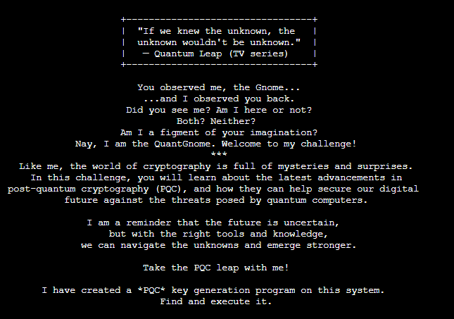
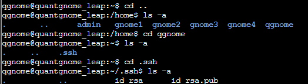
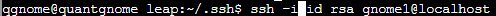
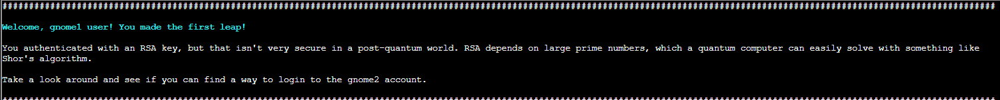

# Quantgnome Leap

 
**Direct link**: [Objective 4](https://2025.holidayhackchallenge.com/badge?section=objective&id=objQuantgnome)

## Objective

I just spotted a mysterious gnome - he winked and vanished, or maybe he's still here?

Things are getting strange, and I think we've wandered into a quantum conundrum!

If you help me unravel these riddles, we might just outsmart future quantum computers.

Cryptic puzzles, quirky gnomes, and post-quantum secrets—will you leap with me?

## Hints

When you give a present, you often put a label on it to let someone know that the present is for them. Sometimes you even say who the present is from. The label is always put on the outside of the present so the public knows the present is for a specific person. SSH keys have something similar called a comment. SSH keys sometimes have a comment that can help determine who and where the key can be used.

User keys are like presents. The keys are kept in a hidden location until they need to be used. Hidden files in Linux always start with a dot. Since everything in Linux is a file, directories that start with a dot are also...hidden!

## Solution

Traverse around the directories looking for a private key to use for SSH.  When viewing directories use -a flag to show hidden files and hidden folders.

SSH with the private RSA key using the gnome1 account

