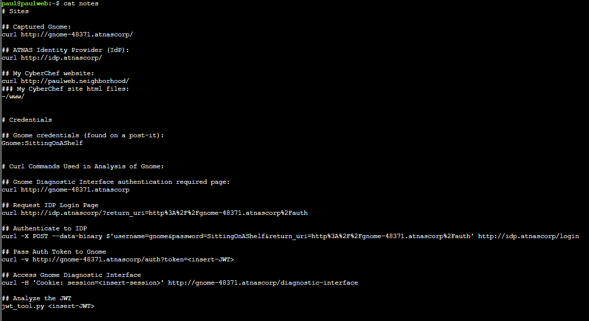

# Rogue Gnome Identity Provider

**Difficulty**: :fontawesome-solid-star::fontawesome-solid-star: 
## Direct link: [https://2025.holidayhackchallenge.com/badge?section=objective&id=objRogueGnome](https://2025.holidayhackchallenge.com/badge?section=objective&id=objRogueGnome)

## Objective

!!! question "Description"
"As a pentester, I proper love a good privilege escalation challenge, and that's exactly what we've got here.  

I've got access to a Gnome's Diagnostic Interface at gnome-48371.atnascorp with the creds  gnome:SittingOnAShelf , but it's just a low-privilege account. 

The gnomes are getting some dodgy updates, and I need admin access to see what's actually going on. 

Ready to help me find a way to bump up our access level, yeah?"

## Hints

??? tip "Hint 1"
    It looks like the JWT uses JWKS. Maybe a JWKS spoofing attack would work.

??? tip "Hint 2"
    https://github.com/ticarpi/jwt_tool/wiki and https://portswigger.net/web-security/jwt have some great information on analyzing JWT's and performing JWT attacks.
	
??? tip "Hint 3"
    If you need to host any files for the attack, the server is running a webserver available locally at http://paulweb.neighborhood/ . The files for the site are stored in ~/www

## Solution

First read the notes file:

