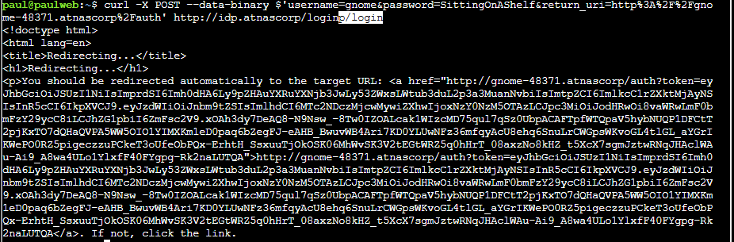
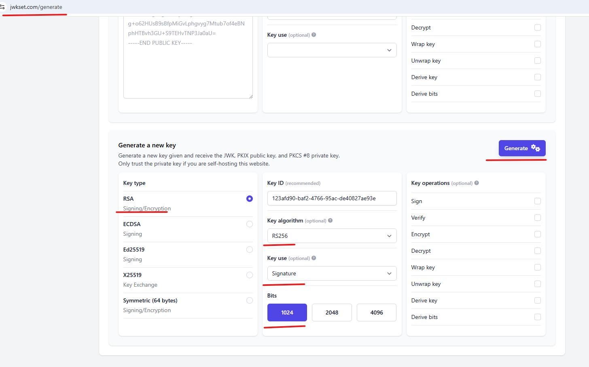
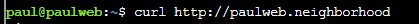
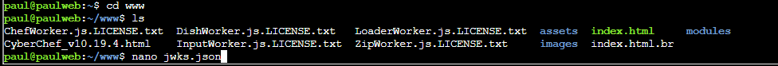
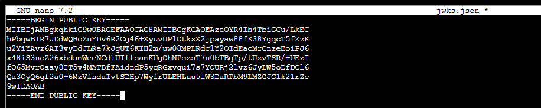

# Rogue Gnome Identity Provider

## Direct link: [https://2025.holidayhackchallenge.com/badge?section=objective&id=objRogueGnome](https://2025.holidayhackchallenge.com/badge?section=objective&id=objRogueGnome)

## Objective

"As a pentester, I proper love a good privilege escalation challenge, and that's exactly what we've got here.  

I've got access to a Gnome's Diagnostic Interface at gnome-48371.atnascorp with the creds  gnome:SittingOnAShelf , but it's just a low-privilege account. 

The gnomes are getting some dodgy updates, and I need admin access to see what's actually going on. 

Ready to help me find a way to bump up our access level, yeah?"

## Hints

    It looks like the JWT uses JWKS. Maybe a JWKS spoofing attack would work.

    https://github.com/ticarpi/jwt_tool/wiki and https://portswigger.net/web-security/jwt have some great information on analyzing JWT's and performing JWT attacks.

    If you need to host any files for the attack, the server is running a webserver available locally at http://paulweb.neighborhood/ . The files for the site are stored in ~/www

## Solution

First read the notes file:

What I didn't realize (and what became obvious in hindsight) is that the notes file tells you all the tasks you need to do in order.

The next thing we want to do is go to the IDP login page and login as low level user:

Now let's login as the <i>Gnome</i> user account with the password <i>SittingOnAShelf</i>

Copy the token and let's load it at the URL jwt.io to see what's inside:

At JWT.IO at the top left, click on the JWT Encoder tab.  Let's update a few items.

First, let's change the JSON web key URL (JKU) to http://paulweb.neighborhood/  
Second, let's change the subject (sub) to admin. 
Third, let's change the admin field to "true"

Last let's get a public private key pair from the URL https://jwkset.com/generate and put the private key in so that we have everything needed to generate our token.

Paste the generated private key into the private key field at JWT.IO.  

We'll return in a bit and to use the new JSON Web Token (JWT) we created.  We need to do one more thing before that... Let's go to the website http//paulweb.neighborhood and place our public key there in a file called jwks.json.  

